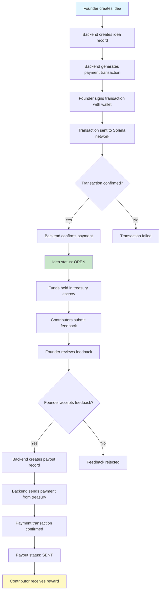

# Payment Flow Documentation

## Overview

This document describes the payment flow for VCTX Feedback Hub, where founders pay to post ideas and contributors receive rewards for accepted feedback.

## High-Level Flow

## Detailed Steps

### 1. Founder Posts Idea and Pays

1. **Frontend**: Founder fills out idea form (title, description, budget, reward amount)
2. **API**: `POST /api/ideas` - Creates idea record in database
3. **API**: `POST /api/ideas/:id/create-payment-tx` - Generates payment transaction
4. **Frontend**: Founder's wallet signs the transaction
5. **Blockchain**: Transaction sent to Solana network
6. **API**: `POST /api/ideas/:id/confirm-payment` - Confirms payment with transaction signature
7. **Database**: Idea status set to `OPEN`, `escrowTxSignature` stored

**Key Points:**
- Payment goes from founder's wallet → platform treasury wallet
- Treasury wallet private key is stored server-side only (never exposed)
- Transaction signature is verified on-chain before confirming

### 2. Contributors Submit Feedback

1. **Frontend**: Contributor connects wallet and views idea
2. **Frontend**: Contributor writes feedback (minimum 300 characters) and selects experience tag
3. **API**: `POST /api/ideas/:id/feedback` - Creates feedback record with status `PENDING`
4. **Database**: Feedback stored, activity log created

**Key Points:**
- No payment required to submit feedback
- Each contributor can only submit one feedback per idea
- Feedback must meet minimum length requirement

### 3. Founder Manages Feedback

1. **Frontend**: Founder views feedback thread for their idea
2. **Founder Actions**:
   - **Shortlist**: `POST /api/feedback/:id/shortlist` - Changes status to `SHORTLISTED`
   - **Accept**: `POST /api/feedback/:id/accept` - Changes status to `ACCEPTED`, creates payout record
   - **Reject**: `POST /api/feedback/:id/reject` - Changes status to `REJECTED`

**Key Points:**
- Only the founder can manage feedback for their idea
- Acceptance is limited by `maxAcceptedFeedbacks` (calculated from budget)
- When feedback is accepted, a payout record is automatically created

### 4. Platform Sends Payouts

1. **API**: `POST /api/payouts/:id/send` - Triggers payout from treasury
2. **Backend**: Constructs transaction from treasury wallet → contributor wallet
3. **Blockchain**: Transaction sent to Solana network
4. **Database**: Payout status updated to `SENT`, transaction signature stored
5. **Frontend**: Contributor can see transaction link

**Key Points:**
- Payouts are sent automatically from the treasury wallet
- Treasury wallet must have sufficient balance (pre-funded)
- Failed transactions are marked as `FAILED` and can be retried

## Security Considerations

1. **Treasury Wallet Security**:
   - Private key stored in environment variables (`.env`)
   - Never logged or exposed to frontend
   - Only used server-side for sending payouts

2. **Transaction Verification**:
   - All payment transactions are verified on-chain before confirmation
   - Transaction signatures are validated before storing

3. **Authorization**:
   - Founders can only manage feedback for their own ideas
   - Wallet addresses are used for authentication

4. **Rate Limiting** (Future Enhancement):
   - Consider adding rate limiting to prevent spam
   - Implement CAPTCHA for feedback submission

## Currency Support

- **SOL**: Native Solana token
- **USDC**: SPL token (Stablecoin)

Both currencies are supported for payments and payouts. The platform uses the appropriate transfer methods for each:
- SOL: `SystemProgram.transfer()`
- USDC: SPL Token `createTransferInstruction()`

## Escrow Model

- Funds are held in the platform treasury wallet
- No automatic refunds in MVP (can be added later)
- Budget tracking ensures `acceptedCount * rewardPerAcceptedFeedback <= totalBudget`
- Leftover funds remain in treasury (manual refund process can be added)

## Error Handling

- Failed transactions are logged and marked appropriately
- Payouts can be retried manually if they fail
- Transaction verification failures prevent idea confirmation
- Invalid wallet addresses are rejected at API level

## Future Enhancements

1. Automatic payout processing (cron job)
2. Refund mechanism for leftover funds
3. Multi-signature treasury wallet
4. On-chain program for escrow (instead of custodial model)
5. Payment notifications
6. Analytics dashboard for founders

